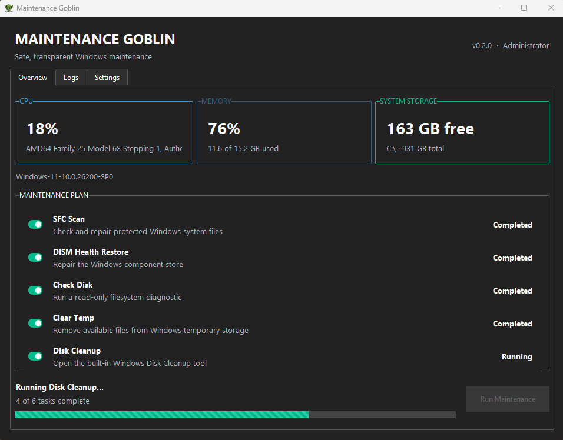

# Maintenance Goblin

Maintenance Goblin is a Windows 10/11 desktop utility for running legitimate built-in maintenance tools from one clear dashboard. It uses conservative defaults and explains what it runs instead of making “PC optimizer” claims.



## Features

- Live CPU, memory, and system-drive statistics
- Selectable maintenance plan with per-task state, elapsed time, duration guidance, and overall progress
- System File Checker (`sfc /scannow`)
- Windows image repair (`DISM /Online /Cleanup-Image /RestoreHealth`)
- Read-only system-drive check (`chkdsk C:`)
- Temporary-file cleanup that skips files Windows will not release
- Windows Disk Cleanup (`cleanmgr`)
- Drive-aware Windows optimization (`defrag C: /O`)
- Dedicated Logs view with text-report export
- Three application themes, optional launch at sign-in, and local achievements
- Safe simulation mode for development and demonstrations

Real maintenance runs request administrator access. Maintenance Goblin does not include a registry cleaner, telemetry by default, advertising, or bundled software.

## Download

Download `MaintenanceGoblin.exe` and its `.sha256` checksum from the [latest GitHub release](https://github.com/uxillary/maintenance-goblin/releases/latest).

The current executable is unsigned, so Windows may show an unknown-publisher or SmartScreen warning. Verify that the file came from this repository and compare its SHA-256 hash before running it:

```powershell
Get-FileHash .\MaintenanceGoblin.exe -Algorithm SHA256
```

## Run from source

Python 3.9 or newer is required. Run these commands from the repository root on Windows:

```powershell
python -m venv .venv
.\.venv\Scripts\python.exe -m pip install -r requirements.txt
.\.venv\Scripts\python.exe .\src\maintenance_goblin.py --test
```

`--test` simulates every task without elevation or system changes. Omit it only when you intend to run the real Windows maintenance commands.

## Command-line options

The source entry point also supports `--cli`, `--silent`, `--run-all`, `--sfc-only`, `--cleanup-only`, and `--export-log PATH`. Real CLI and silent runs require administrator access. The published executable is built as a windowed application, so these options are primarily intended for source-based development and testing.

## Tests and build

```powershell
.\.venv\Scripts\python.exe -m unittest discover -s tests -v
.\.venv\Scripts\python.exe -m pip install pyinstaller
.\build.bat
```

The build script creates `dist\MaintenanceGoblin.exe` as a one-file, windowed executable with the project icon and Windows version metadata.

An NSIS definition is available in `installer.nsi`, but the automated release workflow currently publishes the standalone executable and checksum—not `MaintenanceGoblinSetup.exe`.

## Project information

- [Documentation](docs/index.md)
- [Changelog](CHANGELOG.md)
- [Contributing](CONTRIBUTING.md)
- [Code of Conduct](CODE_OF_CONDUCT.md)
- [MIT License](LICENSE)
