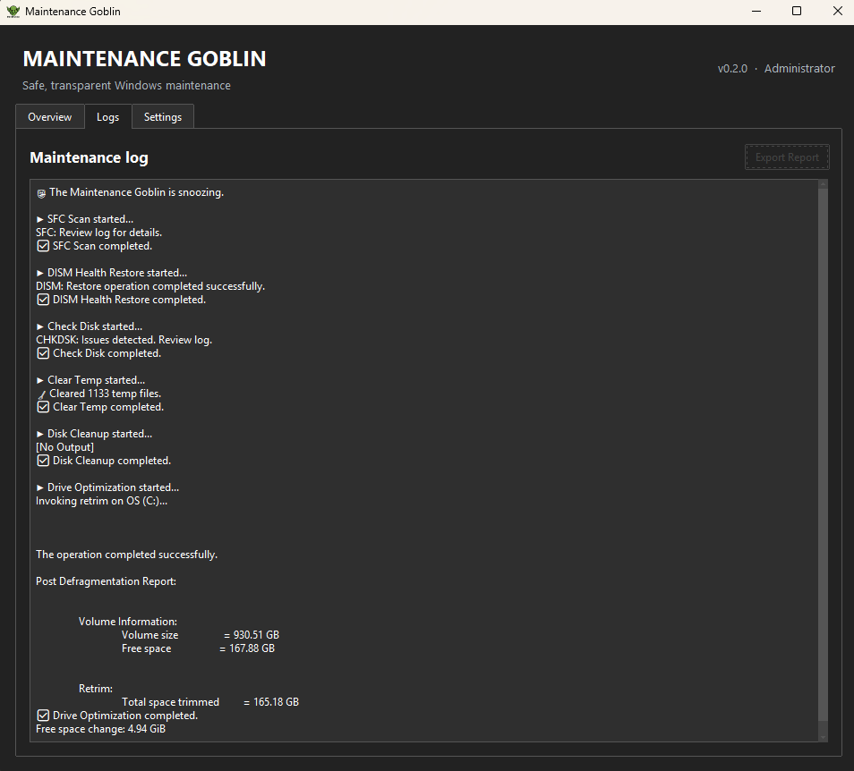

# Maintenance Goblin

Maintenance Goblin is a transparent Windows 10/11 maintenance dashboard for built-in system tools. It runs selected tasks sequentially, keeps the interface responsive, and presents progress without making unsupported performance claims.

[Download the latest release](https://github.com/uxillary/maintenance-goblin/releases/latest) · [View the source](https://github.com/uxillary/maintenance-goblin) · [Report an issue](https://github.com/uxillary/maintenance-goblin/issues)

## Dashboard

The Overview displays live CPU, memory, and system-drive information alongside six selectable tasks:

- SFC system-file scan and repair
- DISM component-store repair
- Read-only CHKDSK diagnostic
- Windows temporary-file cleanup
- Windows Disk Cleanup
- Drive-aware Windows optimization

Each task shows queued, running, completed, or skipped state. The dashboard also provides approximate duration guidance, current-task timing, session timing, and overall progress.


## Logs and reports

Command output is kept in the Logs view. **Export Report** saves the current session log as a timestamped text file under `%APPDATA%\MaintenanceGoblin\logs`.



## Settings

Settings contains the three-theme selector, the optional launch-at-sign-in toggle, and the achievement Gallery. Configuration and achievement data are stored locally under `%APPDATA%\MaintenanceGoblin\config`.

## Safety and privacy

- Real maintenance runs request administrator access before the main interface opens.
- CHKDSK is diagnostic only; repair flags such as `/f` and `/r` are not used.
- Drive optimization uses Windows `/O`, allowing Windows to select the appropriate operation for the media type.
- Temporary cleanup skips locked or inaccessible files.
- Test mode runs simulations without elevation or system changes.
- The application includes no telemetry by default, advertising, registry cleaner, or bundled software.

The published executable is currently unsigned and may trigger an unknown-publisher or SmartScreen warning. Releases include a SHA-256 checksum for verification.

## Development

From the repository root on Windows:

```powershell
python -m venv .venv
.\.venv\Scripts\python.exe -m pip install -r requirements.txt
.\.venv\Scripts\python.exe .\src\maintenance_goblin.py --test
.\.venv\Scripts\python.exe -m unittest discover -s tests -v
```

See the [README](../README.md) for build and command-line details.
